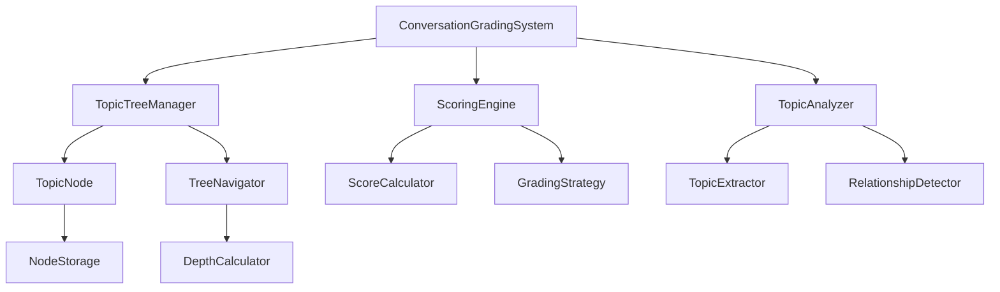

# Design Document

## Overview

The Conversation Grading System is a standalone module that processes Q&A pairs from ongoing conversations and maintains a hierarchical topic tree structure. The system is designed to be modular, reusable, and independent of specific conversation implementations while providing intelligent topic tracking and optional scoring capabilities.

The module will be implemented as a TypeScript class-based system that can be easily integrated into existing conversation systems like the current adaptive interview system, while maintaining clear separation of concerns between tree management and scoring logic.

## Architecture

### Core Components



### System Boundaries

The system operates as a standalone module with the following boundaries:
- **Input**: Q&A pairs with optional metadata
- **Output**: Topic tree structure, navigation recommendations, and optional scores
- **Storage**: In-memory with optional persistence interface
- **Integration**: Clean API for external conversation systems

## Components and Interfaces

### 1. Core Data Models

```typescript
interface QAPair {
  question: string;
  answer: string;
  timestamp: Date;
  metadata?: Record<string, any>;
}

interface TopicNode {
  id: string;
  topic: string;
  parentTopic: string | null;
  children: string[];
  depth: number;
  score: number | null;
  createdAt: Date;
  updatedAt: Date;
  metadata: {
    qaPairs: QAPair[];
    visitCount: number;
    lastVisited: Date | null;
    isExhausted: boolean;
  };
}

interface ConversationTree {
  nodes: Map<string, TopicNode>;
  rootNodes: string[];
  currentPath: string[];
  sessionId: string;
  createdAt: Date;
}
```

### 2. Main System Interface

```typescript
interface IConversationGradingSystem {
  // Core operations
  addQAPair(qaPair: QAPair, score?: number): Promise<string>;
  getTopicTree(): ConversationTree;
  getDepthFromRoot(nodeId: string): number;
  getDeepestUnvisitedBranch(): TopicNode | null;
  
  // Navigation
  getCurrentTopic(): TopicNode | null;
  markTopicAsVisited(nodeId: string): void;
  
  // Configuration
  setScoringStrategy(strategy: IScoringStrategy): void;
  setTopicAnalyzer(analyzer: ITopicAnalyzer): void;
}
```

### 3. Topic Analysis Interface

```typescript
interface ITopicAnalyzer {
  extractTopics(qaPair: QAPair): Promise<string[]>;
  determineRelationship(newTopic: string, existingNodes: TopicNode[]): TopicRelationship;
}

interface TopicRelationship {
  type: 'new_root' | 'child_of' | 'sibling_of' | 'continuation';
  parentNodeId?: string;
  confidence: number;
}
```

### 4. Scoring Interface

```typescript
interface IScoringStrategy {
  calculateScore(qaPair: QAPair, context: ScoringContext): Promise<number>;
}

interface ScoringContext {
  currentTopic: TopicNode;
  conversationHistory: QAPair[];
  topicDepth: number;
}
```

## Data Models

### Topic Node Structure

Each topic node maintains:
- **Identity**: Unique ID and human-readable topic name
- **Hierarchy**: Parent reference and children list for tree structure
- **Depth**: Calculated distance from root nodes
- **Content**: Associated Q&A pairs and metadata
- **State**: Visit tracking and exhaustion status
- **Scoring**: Optional score value with timestamp

### Tree Storage

The conversation tree uses:
- **Map-based storage** for O(1) node access by ID
- **Root node tracking** for multiple conversation branches
- **Current path tracking** for navigation state
- **Session isolation** for concurrent conversations

## Error Handling

### Input Validation
- Validate Q&A pair structure and content
- Sanitize topic names and prevent injection
- Enforce reasonable limits on tree depth and node count

### Tree Integrity
- Prevent circular references in parent-child relationships
- Handle orphaned nodes during tree modifications
- Maintain consistent depth calculations across operations

### Scoring Failures
- Graceful degradation when scoring is unavailable
- Default scoring strategies for fallback scenarios
- Error isolation to prevent tree corruption

### Resource Management
- Memory limits for large conversation trees
- Cleanup strategies for expired sessions
- Performance monitoring for tree operations

## Testing Strategy

### Unit Testing
- **TopicNode operations**: Creation, modification, relationship management
- **Tree navigation**: Depth calculation, path finding, branch traversal
- **Topic analysis**: Extraction algorithms, relationship detection
- **Scoring logic**: Strategy pattern implementation, score calculation

### Integration Testing
- **End-to-end Q&A processing**: Full pipeline from input to tree update
- **Multiple conversation sessions**: Isolation and concurrent access
- **Persistence layer**: Save/load operations if implemented
- **External system integration**: API compatibility with existing systems

### Performance Testing
- **Large tree handling**: Performance with deep hierarchies and many nodes
- **Memory usage**: Resource consumption patterns over time
- **Concurrent access**: Thread safety and race condition prevention
- **Scoring performance**: Impact of different scoring strategies

### Edge Case Testing
- **Empty conversations**: Handling of initial state and first Q&A pair
- **Malformed input**: Invalid Q&A pairs and recovery strategies
- **Tree corruption**: Recovery from inconsistent tree states
- **Resource exhaustion**: Behavior under memory and processing limits

## Implementation Considerations

### Modularity
The system is designed with clear separation of concerns:
- **Tree management** is independent of scoring logic
- **Topic analysis** can be swapped with different algorithms
- **Scoring strategies** can be customized per use case
- **Storage backend** can be replaced without affecting core logic

### Performance
- Use efficient data structures (Map for O(1) lookups)
- Lazy loading of expensive operations (topic analysis)
- Caching of frequently accessed calculations (depth, paths)
- Batch processing capabilities for multiple Q&A pairs

### Extensibility
- Plugin architecture for custom topic analyzers
- Strategy pattern for different scoring approaches
- Event system for external monitoring and logging
- Configuration options for behavior customization

### Integration
- Clean API surface for external systems
- Minimal dependencies on external libraries
- TypeScript interfaces for type safety
- Comprehensive error handling and logging