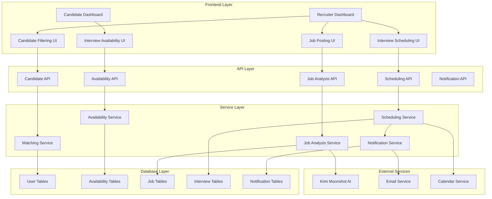

# Design Document

## Overview

The Interview Management System is a comprehensive feature that bridges the gap between candidate availability and recruiter needs through automated matching and scheduling. The system consists of two main user flows: candidate availability management and recruiter job posting with candidate filtering.

The design leverages the existing authentication system (Better Auth), database infrastructure (Drizzle ORM with PostgreSQL), and AI capabilities (Kimi Moonshot model) while introducing new database tables and API endpoints to support interview scheduling workflows.

## Architecture

### High-Level Architecture



### System Components

#### 1. Frontend Components
- **Candidate Dashboard Integration**: New "Interview Availability" tab in existing dashboard
- **Recruiter Dashboard**: Enhanced recruiter interface with job management and candidate filtering
- **Calendar Interface**: Interactive calendar for availability selection and interview scheduling
- **Job Posting Form**: AI-enhanced form for job posting with automatic skill extraction
- **Candidate Ranking Interface**: Sortable, filterable candidate list with match scores

#### 2. API Endpoints
- **Availability Management**: CRUD operations for candidate availability
- **Job Management**: Job posting, editing, and analysis endpoints
- **Candidate Filtering**: Advanced filtering and ranking endpoints
- **Interview Scheduling**: Automated scheduling with conflict resolution
- **Notification System**: Real-time notifications for all parties

#### 3. Database Schema Extensions
- **Recruiter Profiles**: Store recruiter information and organization details
- **Job Postings**: Raw job text and extracted metadata
- **Availability Slots**: Candidate time availability with timezone support
- **Interview Sessions**: Scheduled interviews with status tracking
- **Notifications**: System notifications and communication logs

## Components and Interfaces

### Database Schema Design

#### New Tables

```sql
-- Recruiter profiles table
CREATE TABLE recruiter_profiles (
    id TEXT PRIMARY KEY,
    user_id TEXT NOT NULL REFERENCES user(id) ON DELETE CASCADE,
    organization_name TEXT NOT NULL,
    recruiting_for TEXT NOT NULL,
    contact_email TEXT,
    phone_number TEXT,
    timezone TEXT NOT NULL DEFAULT 'UTC',
    created_at TIMESTAMP NOT NULL DEFAULT NOW(),
    updated_at TIMESTAMP NOT NULL DEFAULT NOW()
);

-- Job postings table
CREATE TABLE job_postings (
    id TEXT PRIMARY KEY,
    recruiter_id TEXT NOT NULL REFERENCES recruiter_profiles(id) ON DELETE CASCADE,
    title TEXT NOT NULL,
    raw_description TEXT NOT NULL,
    extracted_skills JSONB,
    required_skills JSONB,
    preferred_skills JSONB,
    experience_level TEXT,
    salary_min INTEGER,
    salary_max INTEGER,
    location TEXT,
    remote_allowed BOOLEAN DEFAULT FALSE,
    employment_type TEXT DEFAULT 'full-time',
    status TEXT NOT NULL DEFAULT 'active',
    ai_confidence_score DECIMAL(3,2),
    created_at TIMESTAMP NOT NULL DEFAULT NOW(),
    updated_at TIMESTAMP NOT NULL DEFAULT NOW()
);

-- Candidate availability table
CREATE TABLE candidate_availability (
    id TEXT PRIMARY KEY,
    user_id TEXT NOT NULL REFERENCES user(id) ON DELETE CASCADE,
    start_time TIMESTAMP NOT NULL,
    end_time TIMESTAMP NOT NULL,
    timezone TEXT NOT NULL DEFAULT 'UTC',
    is_recurring BOOLEAN DEFAULT FALSE,
    recurrence_pattern JSONB,
    status TEXT NOT NULL DEFAULT 'available',
    created_at TIMESTAMP NOT NULL DEFAULT NOW(),
    updated_at TIMESTAMP NOT NULL DEFAULT NOW()
);

-- Interview sessions table
CREATE TABLE interview_sessions_new (
    id TEXT PRIMARY KEY,
    job_posting_id TEXT NOT NULL REFERENCES job_postings(id) ON DELETE CASCADE,
    candidate_id TEXT NOT NULL REFERENCES user(id) ON DELETE CASCADE,
    recruiter_id TEXT NOT NULL REFERENCES recruiter_profiles(id) ON DELETE CASCADE,
    scheduled_start TIMESTAMP NOT NULL,
    scheduled_end TIMESTAMP NOT NULL,
    timezone TEXT NOT NULL DEFAULT 'UTC',
    status TEXT NOT NULL DEFAULT 'scheduled',
    interview_type TEXT DEFAULT 'video',
    meeting_link TEXT,
    notes TEXT,
    candidate_confirmed BOOLEAN DEFAULT FALSE,
    recruiter_confirmed BOOLEAN DEFAULT FALSE,
    created_at TIMESTAMP NOT NULL DEFAULT NOW(),
    updated_at TIMESTAMP NOT NULL DEFAULT NOW()
);

-- Candidate job matches table
CREATE TABLE candidate_job_matches (
    id TEXT PRIMARY KEY,
    job_posting_id TEXT NOT NULL REFERENCES job_postings(id) ON DELETE CASCADE,
    candidate_id TEXT NOT NULL REFERENCES user(id) ON DELETE CASCADE,
    match_score DECIMAL(5,2) NOT NULL,
    matching_skills JSONB,
    skill_gaps JSONB,
    overall_fit TEXT,
    created_at TIMESTAMP NOT NULL DEFAULT NOW(),
    updated_at TIMESTAMP NOT NULL DEFAULT NOW()
);

-- Notifications table
CREATE TABLE interview_notifications (
    id TEXT PRIMARY KEY,
    user_id TEXT NOT NULL REFERENCES user(id) ON DELETE CASCADE,
    type TEXT NOT NULL,
    title TEXT NOT NULL,
    message TEXT NOT NULL,
    data JSONB,
    read BOOLEAN DEFAULT FALSE,
    sent_at TIMESTAMP,
    created_at TIMESTAMP NOT NULL DEFAULT NOW()
);
```

#### TypeScript Schema Definitions

```typescript
// Recruiter profile interface
export interface RecruiterProfile {
  id: string;
  userId: string;
  organizationName: string;
  recruitingFor: string;
  contactEmail?: string;
  phoneNumber?: string;
  timezone: string;
  createdAt: Date;
  updatedAt: Date;
}

// Job posting interface
export interface JobPosting {
  id: string;
  recruiterId: string;
  title: string;
  rawDescription: string;
  extractedSkills?: ExtractedSkill[];
  requiredSkills?: Skill[];
  preferredSkills?: Skill[];
  experienceLevel?: string;
  salaryMin?: number;
  salaryMax?: number;
  location?: string;
  remoteAllowed: boolean;
  employmentType: string;
  status: 'active' | 'paused' | 'closed';
  aiConfidenceScore?: number;
  createdAt: Date;
  updatedAt: Date;
}

// Candidate availability interface
export interface CandidateAvailability {
  id: string;
  userId: string;
  startTime: Date;
  endTime: Date;
  timezone: string;
  isRecurring: boolean;
  recurrencePattern?: RecurrencePattern;
  status: 'available' | 'booked' | 'unavailable';
  createdAt: Date;
  updatedAt: Date;
}

// Interview session interface
export interface InterviewSession {
  id: string;
  jobPostingId: string;
  candidateId: string;
  recruiterId: string;
  scheduledStart: Date;
  scheduledEnd: Date;
  timezone: string;
  status: 'scheduled' | 'confirmed' | 'completed' | 'cancelled';
  interviewType: 'video' | 'phone' | 'in-person';
  meetingLink?: string;
  notes?: string;
  candidateConfirmed: boolean;
  recruiterConfirmed: boolean;
  createdAt: Date;
  updatedAt: Date;
}
```

### API Design

#### Availability Management API

```typescript
// GET /api/availability
interface GetAvailabilityResponse {
  success: boolean;
  data: {
    availability: CandidateAvailability[];
    upcomingInterviews: InterviewSession[];
  };
}

// POST /api/availability
interface CreateAvailabilityRequest {
  startTime: string;
  endTime: string;
  timezone: string;
  isRecurring?: boolean;
  recurrencePattern?: RecurrencePattern;
}

// PUT /api/availability/[id]
interface UpdateAvailabilityRequest {
  startTime?: string;
  endTime?: string;
  status?: 'available' | 'unavailable';
}

// DELETE /api/availability/[id]
interface DeleteAvailabilityResponse {
  success: boolean;
  conflictingInterviews?: InterviewSession[];
}
```

#### Job Management API

```typescript
// POST /api/recruiter/jobs
interface CreateJobRequest {
  title: string;
  description: string;
  location?: string;
  remoteAllowed?: boolean;
  employmentType?: string;
  salaryMin?: number;
  salaryMax?: number;
}

interface CreateJobResponse {
  success: boolean;
  data: {
    job: JobPosting;
    extractedData: {
      skills: ExtractedSkill[];
      experienceLevel: string;
      salaryRange: { min?: number; max?: number };
      confidence: number;
    };
  };
}

// GET /api/recruiter/jobs/[id]/candidates
interface GetJobCandidatesResponse {
  success: boolean;
  data: {
    candidates: CandidateMatch[];
    totalCount: number;
    filters: FilterOptions;
  };
}

interface CandidateMatch {
  candidate: {
    id: string;
    name: string;
    email: string;
    skills: UserSkill[];
  };
  matchScore: number;
  matchingSkills: Skill[];
  skillGaps: Skill[];
  overallFit: 'excellent' | 'good' | 'fair' | 'poor';
  availability: CandidateAvailability[];
}
```

#### Interview Scheduling API

```typescript
// POST /api/interviews/schedule
interface ScheduleInterviewRequest {
  jobPostingId: string;
  candidateId: string;
  preferredTimes: TimeSlot[];
  interviewType: 'video' | 'phone' | 'in-person';
  duration: number; // minutes
  notes?: string;
}

interface ScheduleInterviewResponse {
  success: boolean;
  data: {
    interview: InterviewSession;
    suggestedTimes?: TimeSlot[];
    conflicts?: ConflictInfo[];
  };
}

// PUT /api/interviews/[id]/confirm
interface ConfirmInterviewRequest {
  confirmed: boolean;
  notes?: string;
}
```

### Service Layer Design

#### Job Analysis Service

```typescript
class JobAnalysisService {
  private aiModel = 'moonshotai/kimi-k2:free';
  
  async analyzeJobPosting(jobDescription: string): Promise<JobAnalysisResult> {
    const prompt = this.buildAnalysisPrompt(jobDescription);
    
    try {
      const response = await this.callKimiAPI(prompt);
      return this.parseAnalysisResponse(response);
    } catch (error) {
      console.error('Job analysis failed:', error);
      throw new Error('Failed to analyze job posting');
    }
  }
  
  private buildAnalysisPrompt(description: string): string {
    return `
      Analyze the following job posting and extract structured information:
      
      Job Description:
      ${description}
      
      Please extract and return in JSON format:
      1. Required skills (array of strings)
      2. Preferred skills (array of strings)
      3. Experience level (entry, mid, senior, executive)
      4. Salary range (min and max if mentioned)
      5. Key buzzwords and technologies
      6. Confidence score (0-1) for the extraction accuracy
      
      Format your response as valid JSON.
    `;
  }
  
  private async callKimiAPI(prompt: string): Promise<any> {
    const response = await fetch('https://openrouter.ai/api/v1/chat/completions', {
      method: 'POST',
      headers: {
        'Authorization': `Bearer ${process.env.OPENROUTER_API_KEY}`,
        'Content-Type': 'application/json',
      },
      body: JSON.stringify({
        model: this.aiModel,
        messages: [{ role: 'user', content: prompt }],
        temperature: 0.1,
      }),
    });
    
    if (!response.ok) {
      throw new Error(`API call failed: ${response.statusText}`);
    }
    
    return response.json();
  }
}
```

#### Candidate Matching Service

```typescript
class CandidateMatchingService {
  async findMatchingCandidates(
    jobPosting: JobPosting,
    filters?: CandidateFilters
  ): Promise<CandidateMatch[]> {
    // Get all candidates with skills
    const candidates = await this.getCandidatesWithSkills(filters);
    
    // Calculate match scores
    const matches = await Promise.all(
      candidates.map(candidate => this.calculateMatch(candidate, jobPosting))
    );
    
    // Sort by match score and return
    return matches
      .filter(match => match.matchScore >= 0.3) // Minimum 30% match
      .sort((a, b) => b.matchScore - a.matchScore);
  }
  
  private async calculateMatch(
    candidate: CandidateWithSkills,
    jobPosting: JobPosting
  ): Promise<CandidateMatch> {
    const requiredSkills = jobPosting.requiredSkills || [];
    const preferredSkills = jobPosting.preferredSkills || [];
    const candidateSkills = candidate.skills;
    
    // Calculate skill matches
    const requiredMatches = this.findSkillMatches(candidateSkills, requiredSkills);
    const preferredMatches = this.findSkillMatches(candidateSkills, preferredSkills);
    
    // Calculate weighted score
    const requiredScore = requiredMatches.length / Math.max(requiredSkills.length, 1);
    const preferredScore = preferredMatches.length / Math.max(preferredSkills.length, 1);
    const matchScore = (requiredScore * 0.7) + (preferredScore * 0.3);
    
    // Determine overall fit
    const overallFit = this.determineOverallFit(matchScore);
    
    return {
      candidate,
      matchScore: Math.round(matchScore * 100) / 100,
      matchingSkills: [...requiredMatches, ...preferredMatches],
      skillGaps: this.findSkillGaps(candidateSkills, requiredSkills),
      overallFit,
      availability: await this.getCandidateAvailability(candidate.id),
    };
  }
}
```

#### Interview Scheduling Service

```typescript
class InterviewSchedulingService {
  async scheduleInterview(
    request: ScheduleInterviewRequest
  ): Promise<ScheduleInterviewResponse> {
    // Find mutual availability
    const mutualSlots = await this.findMutualAvailability(
      request.candidateId,
      request.jobPostingId,
      request.preferredTimes,
      request.duration
    );
    
    if (mutualSlots.length === 0) {
      return {
        success: false,
        data: {
          suggestedTimes: await this.suggestAlternativeTimes(request),
          conflicts: await this.getConflicts(request),
        },
      };
    }
    
    // Create interview session
    const interview = await this.createInterviewSession({
      ...request,
      scheduledStart: mutualSlots[0].start,
      scheduledEnd: mutualSlots[0].end,
    });
    
    // Send notifications
    await this.notificationService.sendInterviewScheduledNotifications(interview);
    
    return {
      success: true,
      data: { interview },
    };
  }
  
  private async findMutualAvailability(
    candidateId: string,
    jobPostingId: string,
    preferredTimes: TimeSlot[],
    duration: number
  ): Promise<TimeSlot[]> {
    // Get candidate availability
    const candidateAvailability = await this.getAvailability(candidateId);
    
    // Get recruiter availability (from job posting)
    const recruiter = await this.getRecruiterFromJob(jobPostingId);
    const recruiterAvailability = await this.getRecruiterAvailability(recruiter.id);
    
    // Find overlapping time slots
    return this.findOverlappingSlots(
      candidateAvailability,
      recruiterAvailability,
      preferredTimes,
      duration
    );
  }
}
```

## Data Models

### Core Data Structures

#### Skill Matching Models

```typescript
interface ExtractedSkill {
  name: string;
  confidence: number;
  category: 'technical' | 'soft' | 'domain';
  synonyms: string[];
}

interface UserSkill {
  id: string;
  skillName: string;
  proficiencyScore: number;
  mentionCount: number;
  averageConfidence: number;
  lastMentioned: Date;
}

interface SkillMatch {
  skill: string;
  candidateScore: number;
  required: boolean;
  confidence: number;
}
```

#### Time Management Models

```typescript
interface TimeSlot {
  start: Date;
  end: Date;
  timezone: string;
}

interface RecurrencePattern {
  type: 'daily' | 'weekly' | 'monthly';
  interval: number;
  daysOfWeek?: number[]; // 0-6, Sunday = 0
  endDate?: Date;
  maxOccurrences?: number;
}

interface ConflictInfo {
  type: 'existing_interview' | 'unavailable' | 'outside_hours';
  conflictingSlot: TimeSlot;
  description: string;
}
```

#### Notification Models

```typescript
interface NotificationTemplate {
  type: 'interview_scheduled' | 'interview_confirmed' | 'interview_cancelled' | 'availability_updated';
  subject: string;
  template: string;
  variables: string[];
}

interface NotificationData {
  interviewId?: string;
  candidateName?: string;
  recruiterName?: string;
  jobTitle?: string;
  scheduledTime?: Date;
  meetingLink?: string;
}
```

## Error Handling

### Error Categories and Responses

#### Validation Errors
```typescript
interface ValidationError {
  code: 'VALIDATION_ERROR';
  message: string;
  field: string;
  value: any;
}

// Example: Invalid time slot
{
  code: 'VALIDATION_ERROR',
  message: 'Start time must be in the future',
  field: 'startTime',
  value: '2024-01-01T10:00:00Z'
}
```

#### Scheduling Conflicts
```typescript
interface SchedulingError {
  code: 'SCHEDULING_CONFLICT';
  message: string;
  conflicts: ConflictInfo[];
  suggestedAlternatives: TimeSlot[];
}
```

#### AI Processing Errors
```typescript
interface AIProcessingError {
  code: 'AI_PROCESSING_ERROR';
  message: string;
  fallbackData?: Partial<JobAnalysisResult>;
  retryable: boolean;
}
```

### Error Handling Strategies

1. **Graceful Degradation**: When AI analysis fails, allow manual skill entry
2. **Retry Logic**: Implement exponential backoff for transient failures
3. **User Feedback**: Provide clear, actionable error messages
4. **Logging**: Comprehensive error logging for debugging and monitoring
5. **Fallback Options**: Alternative flows when primary features fail

## Testing Strategy

### Unit Testing

#### Service Layer Tests
```typescript
describe('JobAnalysisService', () => {
  it('should extract skills from job description', async () => {
    const service = new JobAnalysisService();
    const result = await service.analyzeJobPosting(mockJobDescription);
    
    expect(result.requiredSkills).toContain('JavaScript');
    expect(result.experienceLevel).toBe('mid');
    expect(result.confidence).toBeGreaterThan(0.8);
  });
  
  it('should handle AI service failures gracefully', async () => {
    const service = new JobAnalysisService();
    mockKimiAPI.mockRejectedValue(new Error('API Error'));
    
    await expect(service.analyzeJobPosting(mockJobDescription))
      .rejects.toThrow('Failed to analyze job posting');
  });
});

describe('CandidateMatchingService', () => {
  it('should rank candidates by skill match score', async () => {
    const service = new CandidateMatchingService();
    const matches = await service.findMatchingCandidates(mockJobPosting);
    
    expect(matches).toHaveLength(3);
    expect(matches[0].matchScore).toBeGreaterThan(matches[1].matchScore);
  });
});
```

#### Component Tests
```typescript
describe('AvailabilityCalendar', () => {
  it('should display candidate availability slots', () => {
    render(<AvailabilityCalendar availability={mockAvailability} />);
    
    expect(screen.getByText('Available')).toBeInTheDocument();
    expect(screen.getByText('Jan 15, 2024')).toBeInTheDocument();
  });
  
  it('should handle slot selection', async () => {
    const onSelect = jest.fn();
    render(<AvailabilityCalendar onSlotSelect={onSelect} />);
    
    await user.click(screen.getByText('10:00 AM'));
    expect(onSelect).toHaveBeenCalledWith(expect.objectContaining({
      start: expect.any(Date),
      end: expect.any(Date),
    }));
  });
});
```

### Integration Testing

#### API Integration Tests
```typescript
describe('Interview Scheduling API', () => {
  it('should schedule interview with mutual availability', async () => {
    // Setup test data
    await createTestCandidate();
    await createTestRecruiter();
    await createTestAvailability();
    
    const response = await request(app)
      .post('/api/interviews/schedule')
      .send(mockScheduleRequest)
      .expect(200);
    
    expect(response.body.success).toBe(true);
    expect(response.body.data.interview).toBeDefined();
  });
  
  it('should handle scheduling conflicts', async () => {
    // Create conflicting interview
    await createConflictingInterview();
    
    const response = await request(app)
      .post('/api/interviews/schedule')
      .send(mockScheduleRequest)
      .expect(409);
    
    expect(response.body.conflicts).toHaveLength(1);
    expect(response.body.suggestedTimes).toBeDefined();
  });
});
```

### End-to-End Testing

#### User Journey Tests
```typescript
describe('Complete Interview Scheduling Flow', () => {
  it('should allow candidate to set availability and recruiter to schedule interview', async () => {
    // Candidate sets availability
    await candidatePage.setAvailability([
      { start: '2024-01-15T10:00:00Z', end: '2024-01-15T12:00:00Z' }
    ]);
    
    // Recruiter posts job
    await recruiterPage.postJob(mockJobData);
    
    // Recruiter views candidates
    await recruiterPage.viewCandidates();
    expect(recruiterPage.getCandidateCount()).toBeGreaterThan(0);
    
    // Recruiter schedules interview
    await recruiterPage.scheduleInterview(candidateId, timeSlot);
    
    // Verify notifications sent
    expect(await candidatePage.getNotifications()).toContain('Interview Scheduled');
    expect(await recruiterPage.getNotifications()).toContain('Interview Confirmed');
  });
});
```

### Performance Testing

#### Load Testing Scenarios
1. **Concurrent Availability Updates**: 100 candidates updating availability simultaneously
2. **Job Analysis Load**: 50 job postings being analyzed concurrently
3. **Candidate Matching**: Large-scale candidate filtering with 1000+ candidates
4. **Scheduling Conflicts**: High-frequency scheduling attempts with limited availability

#### Performance Benchmarks
- Job analysis: < 5 seconds for typical job posting
- Candidate matching: < 2 seconds for 500 candidates
- Availability updates: < 500ms response time
- Interview scheduling: < 1 second for conflict-free scheduling

This comprehensive design provides a solid foundation for implementing the interview management system while maintaining consistency with the existing codebase architecture and patterns.