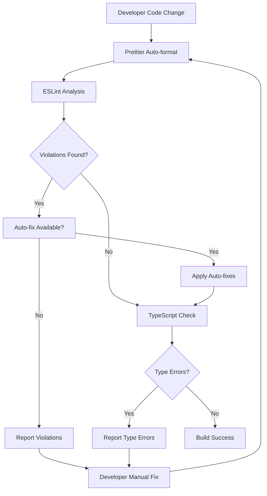

# Design Document

## Overview

This design establishes a comprehensive repository guidelines system for a Next.js TypeScript project using pnpm as the package manager. The system will enhance the existing setup with additional tooling, configurations, and workflows to ensure consistent code quality, standardized naming conventions, and smooth developer experience.

The current project already has a solid foundation with Next.js 15.4.5, TypeScript with strict mode, Tailwind CSS v4, and basic ESLint configuration. This design will build upon these foundations to create a complete development environment.

## Architecture

### Configuration Layer
The configuration layer consists of multiple interconnected configuration files that work together to enforce standards:

```
Repository Guidelines System
├── Code Quality Layer
│   ├── ESLint Configuration (eslint.config.mjs)
│   ├── Prettier Configuration (.prettierrc)
│   └── TypeScript Configuration (tsconfig.json)
├── Build System Layer
│   ├── Package Scripts (package.json)
│   └── Next.js Configuration (next.config.ts)
├── Project Structure Layer
│   ├── Directory Organization
│   └── Path Aliases Configuration
└── Documentation Layer
    ├── Guidelines Documentation
    └── Workflow Examples
```

### Tool Integration Flow


## Components and Interfaces

### 1. Enhanced ESLint Configuration
**Purpose**: Extend the existing ESLint setup with additional rules for naming conventions, import ordering, and code quality.

**Current State**: Basic Next.js ESLint configuration with TypeScript support
**Enhancement**: Add custom rules for naming conventions, import ordering, and React best practices

```javascript
// eslint.config.mjs (enhanced)
const eslintConfig = [
  ...compat.extends("next/core-web-vitals", "next/typescript"),
  {
    rules: {
      // Naming convention rules
      "@typescript-eslint/naming-convention": [
        "error",
        {
          "selector": "variableLike",
          "format": ["camelCase"]
        },
        {
          "selector": "typeLike",
          "format": ["PascalCase"]
        },
        {
          "selector": "variable",
          "modifiers": ["const", "global"],
          "format": ["UPPER_CASE"]
        }
      ],
      // Import ordering rules
      "import/order": [
        "error",
        {
          "groups": [
            ["builtin", "external"],
            ["internal"],
            ["parent", "sibling", "index"]
          ],
          "newlines-between": "always",
          "pathGroups": [
            {
              "pattern": "~/**",
              "group": "internal"
            }
          ]
        }
      ]
    }
  }
];
```

### 2. Prettier Configuration
**Purpose**: Ensure consistent code formatting across all files

```json
{
  "tabWidth": 2,
  "semi": true,
  "singleQuote": true,
  "trailingComma": "es5",
  "printWidth": 80,
  "bracketSpacing": true,
  "arrowParens": "avoid"
}
```

### 3. Enhanced Package Scripts
**Purpose**: Provide comprehensive npm scripts for development workflow

```json
{
  "scripts": {
    "dev": "next dev --turbopack",
    "build": "next build",
    "start": "next start",
    "lint": "next lint",
    "lint:prettier": "prettier --check .",
    "fix:prettier": "prettier --write .",
    "fix:eslint": "next lint --fix",
    "type-check": "tsc --noEmit",
    "quality-check": "pnpm lint && pnpm lint:prettier && pnpm type-check"
  }
}
```

### 4. Project Structure Organization
**Purpose**: Establish clear directory structure with logical separation of concerns

```
src/
├── app/                 # Next.js app directory (existing)
├── components/          # Reusable UI components
│   ├── ui/             # Basic UI primitives
│   └── features/       # Feature-specific components
├── lib/                # Utility functions and configurations
│   ├── utils.ts        # General utilities
│   └── constants.ts    # Application constants
├── types/              # TypeScript type definitions
│   ├── global.ts       # Global type definitions
│   └── api.ts          # API-related types
└── styles/             # Global styles and Tailwind customizations
    └── globals.css     # Global CSS (existing)
```

### 5. Path Aliases Enhancement
**Purpose**: Maintain clean import statements using the existing ~/ alias

The current tsconfig.json already includes the path alias configuration:
```json
{
  "paths": {
    "~/*": ["./src/*"]
  }
}
```

## Data Models

### Configuration Schema
```typescript
interface RepositoryConfig {
  linting: {
    eslint: ESLintConfig;
    prettier: PrettierConfig;
  };
  typescript: {
    strict: boolean;
    pathAliases: Record<string, string[]>;
  };
  scripts: {
    development: string;
    build: string;
    qualityCheck: string[];
    autoFix: string[];
  };
  structure: {
    components: string;
    utilities: string;
    types: string;
    styles: string;
  };
}
```

### Naming Convention Rules
```typescript
interface NamingConventions {
  files: {
    components: 'kebab-case';
    utilities: 'kebab-case';
    types: 'kebab-case';
  };
  code: {
    components: 'PascalCase';
    variables: 'camelCase';
    functions: 'camelCase';
    constants: 'UPPER_SNAKE_CASE';
    types: 'PascalCase';
    interfaces: 'PascalCase';
  };
  css: {
    classes: 'kebab-case';
    ids: 'kebab-case';
  };
}
```

## Error Handling

### Linting Errors
- **Detection**: ESLint will identify violations during development and CI
- **Resolution**: Provide clear error messages with file locations and suggested fixes
- **Auto-fix**: Many violations can be automatically resolved using `pnpm fix:eslint`

### Formatting Errors
- **Detection**: Prettier will identify formatting inconsistencies
- **Resolution**: Automatic formatting using `pnpm fix:prettier`
- **Prevention**: IDE integration for format-on-save

### Type Errors
- **Detection**: TypeScript compiler will catch type violations
- **Resolution**: Clear error messages with specific type requirements
- **Prevention**: Strict mode configuration prevents common type issues

### Build Errors
- **Detection**: Next.js build process will identify compilation issues
- **Resolution**: Comprehensive error reporting with stack traces
- **Prevention**: Pre-build quality checks using `pnpm quality-check`

## Testing Strategy

### Configuration Testing
1. **ESLint Rule Validation**: Test that custom rules correctly identify violations
2. **Prettier Formatting**: Verify consistent formatting across different file types
3. **TypeScript Compilation**: Ensure strict mode catches type violations
4. **Path Alias Resolution**: Test that ~/ aliases resolve correctly

### Workflow Testing
1. **Script Execution**: Verify all package.json scripts execute successfully
2. **Auto-fix Functionality**: Test that auto-fix commands resolve issues without breaking code
3. **Build Process**: Ensure production builds complete successfully with all quality checks

### Integration Testing
1. **IDE Integration**: Test that configurations work with popular IDEs (VS Code, WebStorm)
2. **Git Hooks**: Verify pre-commit hooks prevent commits with quality violations
3. **CI/CD Integration**: Ensure quality checks run successfully in continuous integration

### Example Test Cases
```typescript
// Test naming convention enforcement
describe('Naming Conventions', () => {
  it('should enforce kebab-case for component files', () => {
    // Test that UserProfileCard component is in user-profile-card.tsx
  });
  
  it('should enforce PascalCase for component names', () => {
    // Test that component exports use PascalCase
  });
  
  it('should enforce camelCase for variables', () => {
    // Test that variables follow camelCase convention
  });
});

// Test import ordering
describe('Import Organization', () => {
  it('should order React imports first', () => {
    // Test import order enforcement
  });
  
  it('should separate import groups with blank lines', () => {
    // Test import group separation
  });
});
```

### Quality Metrics
- **Linting Coverage**: 100% of TypeScript/JavaScript files should pass linting
- **Formatting Consistency**: 100% of files should follow Prettier formatting
- **Type Safety**: 100% type coverage with strict TypeScript configuration
- **Build Success**: All builds should complete without errors or warnings

This design provides a comprehensive foundation for implementing repository guidelines that will enhance code quality, developer experience, and project maintainability while building upon the existing Next.js, TypeScript, and Tailwind CSS setup.